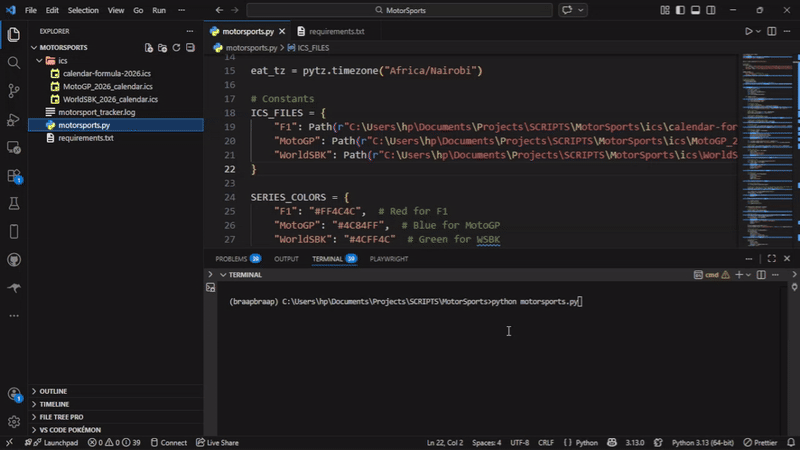

<p align="center">
  
</p>


A lightweight desktop command center for tracking elite motorsport events in real time. Built with Tkinter.

Track upcoming races from:
- F1
- MotoGP
- WorldSBK

Features:
- 📅 Calendar view with race markers
- ⏳ Live countdown timer
- 🎨 Color-coded series
- 📊 Filter by series or race-only events
- 🔄 Auto refresh

---

## 📦 Project Structure

```

MotorSports/
├── ics/
│   ├── MotoGP_2026_calendar.ics
│   ├── WorldSBK_2026_calendar.ics
│   └── calendar-formula-2026.ics
├── motorsports.py
├── requirements.txt
├── motorsports.gif
└── Motorsports demo.mp4

````

---

## 🚀 Installation

```bash
git clone https://github.com/MaswiliK/MotorSports.git
cd MotorSports
pip install -r requirements.txt
python motorsports.py
````

---

## 🧠 Built With

* Python
* Tkinter
* tkcalendar
* icalendar
* pytz
* schedule

---

## 🎥 Demo



---

# 🙏 Credits & Acknowledgments

This project uses publicly available motorsport calendar data.

---

### 🏍️ Bike Calendars (MotoGP & WorldSBK)

[](https://nixxo.github.io/calendars/)
[](https://nixxo.github.io/calendars/)
[](https://nixxo.github.io/calendars/)

Calendar data generated via:

🔗 [https://nixxo.github.io/calendars/](https://nixxo.github.io/calendars/)

---

### 🏎️ Formula 1 (2026 Season)

[](https://racingnews365.com/add-the-2026-f1-calendar-to-your-agenda-with-one-click)
[](https://racingnews365.com/add-the-2026-f1-calendar-to-your-agenda-with-one-click)

Calendar source:

🔗 [https://racingnews365.com/add-the-2026-f1-calendar-to-your-agenda-with-one-click](https://racingnews365.com/add-the-2026-f1-calendar-to-your-agenda-with-one-click)

---

## 🏁 Disclaimer

This project is an independent desktop tracker and is not affiliated with:

* Formula One
* MotoGP
* Superbike World Championship

All trademarks belong to their respective owners.

---

